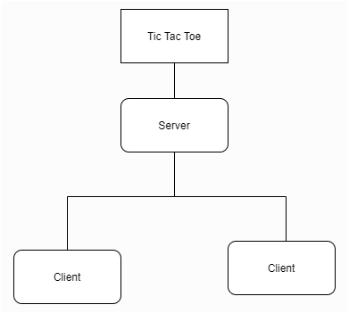
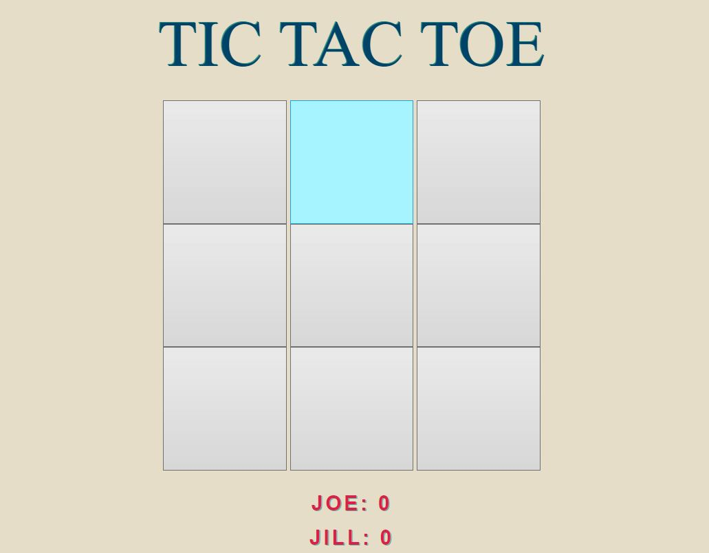

#Tic Tac Toe Online
##Sockets
Una red de sockets es una estructura de software en el que cada computadora y el servidor actuan como puntos de recepcion y emision de informacion. La interaccion entre clientes y servidor son hechos a través de sockets, los cuales son puertos que permiten la conexion para emision y recepcion con el servidor.

##Diseño
Para lograr que todos los clientes esten en la misma pagina en cuanto al tablero y los puntajes de los juegos, el juego logico de tic tac toe esta en el servidor, mientras que los clientes piden consistentemente el estado de la matriz. Cada accion hecha por el cliente es recibida por el servidor para determinar si es una jugada valida. 



##Implementacion
Como el programa entero es un conjunto de eventos y una interaccion constante cliente/servidor, no es propicio enseñar todas las iteraciones de uso de sockets, sin embargo se puede mostrar la conexion de los clientes.
```typescript
socket.on('createRoom', (roomID : string, name : string) => {
    if(io.sockets.adapter.rooms[roomID] == null){
        socket.join(roomID)
        console.log('Socket: ' + socket.id + ' into room: ' + roomID)
        players[0] = new tictactoe.Player(socket.id, name, 0)
    }
});

socket.on('joinRoom', (roomID : string, name : string) => {
    var room = io.sockets.adapter.rooms.get(roomID)
    if(room != null && room.size == 1){
    socket.join(roomID)
    console.log('Socket: ' + socket.id + ' joined room: ' + roomID)
    players[1] = new tictactoe.Player(socket.id, name, 0, "O")
    if(room.size == 2){
        startGame()
        socket.to(players[0].ID).emit('startGame', {names : [players[0].name, players[1].name], scores : [players[0].score, players[1].score]})
        socket.to(players[1].ID).emit('startGame', {names : [players[0].name, players[1].name], scores : [players[0].score, players[1].score]})
    }else{
    console.log('Invalid or ' + roomID + ' Room...');
    }
});
```

En el evento de creaRoom, el servidor une el cliente a una sala nueva y se crea el jugador 1 en base al socket conectado, mientras que joinRoom primero busca si la sala existe, para luego unirse en el caso de que asi sea. Claramente se crea el segundo jugador en base al
segundo socket conectado.

##Layout
